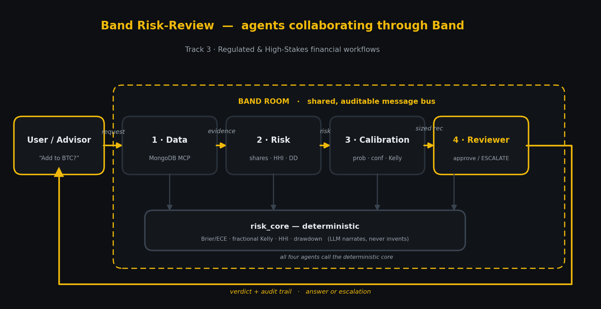

# Band Risk-Review

**A multi-agent compliance workflow for high-stakes financial decisions — four specialized agents collaborating through Band.**

Submission for the **Band of Agents Hackathon** (lablab.ai), **Track 3 — Regulated & High-Stakes workflows**. Built by Ruiyang Zhang (passed all three CFA Program exams). MIT.



## The idea

Most "AI finance agents" are a single model answering every question with the same false confidence. Real regulated finance doesn't work that way — it runs on **separation of duties**: the desk that proposes a trade is not the desk that approves it, and risk numbers come from a deterministic system, not someone's gut.

Band Risk-Review encodes exactly that as a band of four agents, each with one job, collaborating through Band:

1. **Data Agent** — retrieves the portfolio + market snapshot (MongoDB Atlas via MCP in the real build) and posts a structured *evidence packet*. Never invents data.
2. **Risk Agent** — computes deterministic portfolio risk: volatility-weighted risk shares, HHI concentration, a parametric drawdown estimate.
3. **Calibration Agent** — turns fused signals into a **calibrated probability + explicit confidence**, sizes the position by **fractional Kelly**, and **abstains** when confidence is below floor or signals conflict.
4. **Reviewer Agent** — an *independent* compliance gate. It reads the proposal and the risk metrics, checks them against policy limits, and returns one of: **APPROVED**, **APPROVED_WITH_CONDITIONS** (trim), **ESCALATE** (to a human risk officer), or **ABSTAIN_UPHELD**. It can veto.

The differentiator for Track 3: the **Reviewer is a separate agent that can override the Calibration Agent**, and every step is an auditable message on the shared Band room — a regulator-friendly trace of who said what and why.

## Honest design choice: deterministic core

All risk math lives in `risk_core.py` (Brier/ECE, fractional Kelly, HHI, drawdown). The agents *call* it and the LLM only narrates the results. The model never produces a risk number out of its head — the anti-hallucination guarantee that matters in regulated finance.

## Run it (no network, no credentials)

```
python run_demo.py        # four scenarios through the four agents
python test_workflow.py   # 16/16 — math + multi-agent handoff
```

The demo shows the full range of honest behaviour:

| Ask | Outcome | Why |
|---|---|---|
| Add to BTC? | **APPROVED**, size 11.4% | clean signals, drawdown contribution within gate |
| Add ETH (hot on socials)? | **ABSTAIN** | funding vs momentum conflict → confidence below floor |
| Add DOGE? | **ABSTAIN** | no data on the asset |
| Add SOL? | **ESCALATE** | drawdown contribution 9% of NAV > 6% gate → human review |

## Architecture seam (how Band plugs in)

The agents depend only on the `Bus` protocol in `band_bus.py`. `LocalBandBus` is an in-memory stand-in for a Band room so the whole workflow runs offline today. At the June 12 kickoff, swap in a thin `RealBandBus` adapter over the Band SDK **without touching any agent logic**. See `band_wiring_prompt.md` for the exact build prompt.

## Files

**Offline scaffold (runs now, no creds — proves the logic):**

- `risk_core.py` — deterministic risk + calibration math (pure functions)
- `band_bus.py` — the collaboration layer (`Bus` protocol + `LocalBandBus`)
- `agents.py` — the four agents (mock-bus version)
- `seed_data.py` — sample portfolio + market snapshot
- `run_demo.py` — orchestrates the four scenarios
- `test_workflow.py` — tests (math + workflow), 16/16

**Going live on Band (run on your machine — see `SETUP_BAND.md`):**

- `risk_tools.py` — the deterministic c